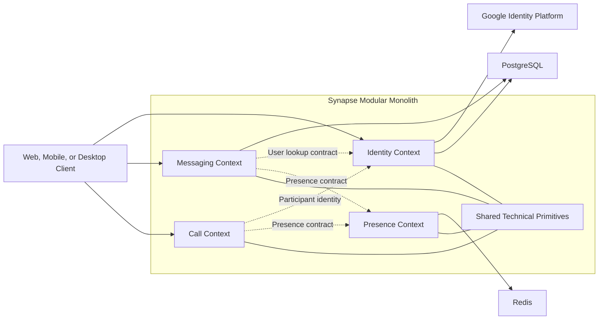
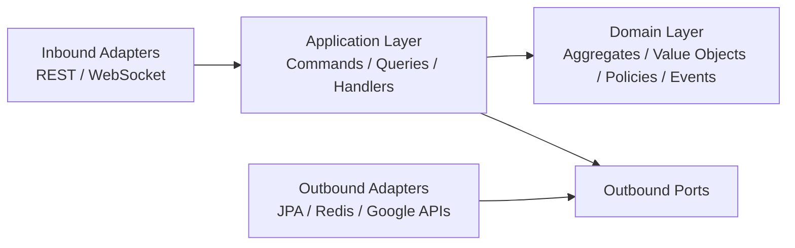
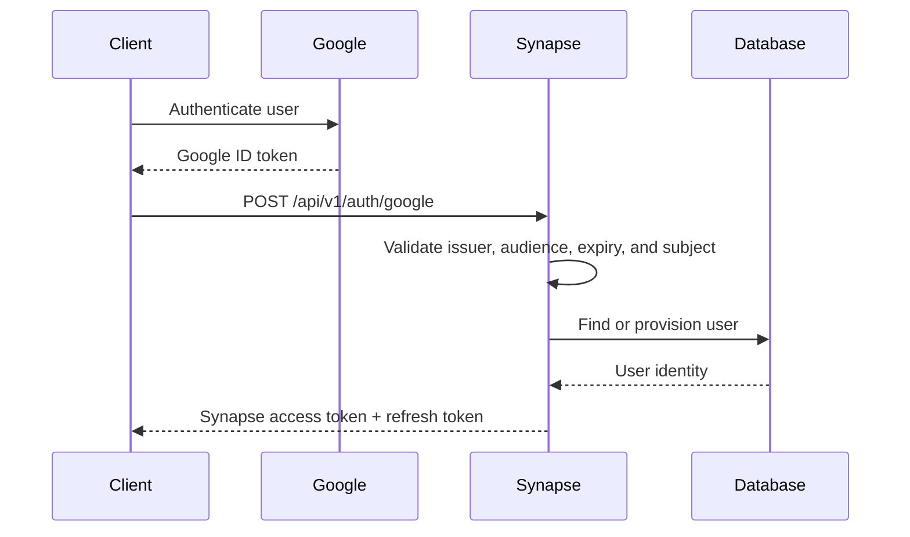

<div align="center">

<!-- Add a project banner here when available:

-->

# Synapse

**A modular real-time communication backend for messaging, presence, and WebRTC signaling.**

[](https://github.com/dev-amir/synapse/actions)
[](https://openjdk.org)
[](https://spring.io/projects/spring-boot)
[](https://alistair.cockburn.us/hexagonal-architecture/)
[](https://google.github.io/styleguide/javaguide.html)
[](LICENSE)

[Overview](#overview) •
[Architecture](#architecture) •
[Getting Started](#getting-started) •
[Documentation](#documentation) •
[API Documentation](#api-documentation) •
[Roadmap](#roadmap)

</div>

---

## Overview

Synapse is a modular backend for real-time communication systems, including text messaging, user presence, voice calls, and video-call signaling.

The project is designed as a **modular monolith** so that architectural boundaries can be validated before introducing the operational complexity of microservices. Each bounded context owns its domain model, use cases, persistence adapters, and external integrations.

Synapse is also a production-oriented engineering project for exploring:

- Domain-Driven Design and aggregate modeling
- Hexagonal Architecture and dependency inversion
- Command/query separation
- Secure identity and token lifecycles
- Cross-context communication
- WebSocket session management
- WebRTC signaling
- Distributed-system reliability

It is not currently presented as a production SaaS. The goal is to build and document the difficult backend concerns behind real-time communication systems with clear boundaries, testable domain logic, and explicit engineering trade-offs.

---

## Core Capabilities

### Implemented

- Google ID token verification and just-in-time user provisioning
- Native Synapse access and refresh token issuance
- Refresh-token lifecycle and concurrency protection
- Room aggregate with explicit domain invariants
- Direct, group, and channel room creation
- Room membership validation through the Identity bounded context
- Command/query separation for room creation and room retrieval
- PostgreSQL persistence
- Automated formatting and static-analysis checks

### In Progress

- Real-time message delivery over WebSocket
- Message persistence, acknowledgement, and delivery state
- Redis-backed presence tracking
- WebRTC offer, answer, and ICE-candidate signaling
- Domain-event publication between bounded contexts
- Broader integration and reliability testing

---

## Bounded Contexts

| Context | Responsibility | Current State |
|---|---|---|
| `identity` | Google authentication, user provisioning, Synapse token lifecycle, and internal user lookup | Implemented |
| `messaging` | Rooms, memberships, messaging commands, and room queries | Room domain implemented; real-time delivery in progress |
| `call` | Voice and video signaling through WebRTC | In progress |
| `presence` | Ephemeral user and session availability backed by Redis | In progress |
| `shared` | Carefully limited cross-cutting primitives and technical support | Available |

> Business concepts remain owned by their bounded contexts. The `shared` module should not become a general-purpose location for domain logic.

---

## Architecture

### Current and Planned System Overview

Solid connections describe the current application shape. Dashed connections represent cross-context collaboration that is implemented or planned as the related modules evolve.

### Hexagonal Structure

Each bounded context follows the same dependency direction:




### Dependency Rules

- Domain code contains no Spring, JPA, HTTP, or database dependencies.
- Application handlers coordinate use cases, domain behavior, and transaction boundaries.
- Inbound contracts define the operations exposed by a bounded context.
- Outbound ports describe persistence and external-service requirements.
- Infrastructure adapters implement those contracts.
- A bounded context cannot access another context's repositories, JPA entities, or internal domain objects.
- Cross-context collaboration happens through narrow application-facing contracts or published events.
- Dependencies point toward the application and domain core.

### Cross-Context Boundaries

| Consumer    | Provider   | Purpose                                                   | State       |
|-------------|------------|-----------------------------------------------------------|-------------|
| `messaging` | `identity` | Validate room members and resolve public user information | Implemented |
| `call`      | `identity` | Validate call participants                                | Planned     |
| `messaging` | `presence` | Read participant availability                             | Planned     |
| `call`      | `presence` | Coordinate call availability and session state            | Planned     |

The implemented Identity-to-Messaging integration uses a read-only lookup contract rather than sharing Identity's persistence model.

<details>
<summary><strong>View the project structure</strong></summary>

```text
synapse/
├── identity/
│   └── src/main/java/dev/amir/synapse/identity/
│       ├── domain/
│       │   ├── model/
│       │   ├── event/
│       │   ├── port/
│       │   │   ├── in/
│       │   │   └── out/
│       │   └── value_object/
│       ├── application/
│       └── infrastructure/
│           └── adapter/
│               ├── in/
│               └── out/
├── messaging/
├── call/
├── presence/
├── shared/
└── pom.xml
```

</details>

---

## Technology Stack

| Area                | Technology                                      |
|---------------------|-------------------------------------------------|
| Language            | Java 21                                         |
| Framework           | Spring Boot 4.0.6                               |
| Architecture        | Modular Monolith, Hexagonal Architecture, DDD   |
| Application model   | Commands, queries, handlers, and explicit ports |
| Persistence         | PostgreSQL                                      |
| Ephemeral state     | Redis                                           |
| Authentication      | Google ID tokens and Synapse-issued JWTs        |
| Real-time messaging | WebSocket                                       |
| Voice and video     | WebRTC signaling                                |
| Build               | Maven Wrapper                                   |
| Infrastructure      | Docker and Docker Compose                       |
| Code quality        | Spotless, Checkstyle, PMD, SpotBugs             |
| CI/CD               | GitHub Actions                                  |

---

## Key Engineering Decisions

### Modular monolith before microservices

Synapse keeps bounded contexts inside one deployable application while enforcing module boundaries in code. This makes architectural violations easier to detect without introducing network failures, distributed transactions, deployment coordination, and observability costs prematurely.

### Domain behavior independent of frameworks

Aggregates, value objects, policies, and domain events do not depend on Spring or persistence annotations. Domain invariants can therefore be tested without starting the application or connecting to a database.

### Explicit cross-context communication

One bounded context cannot read another context's tables or repositories directly. For example, Messaging validates room members through a read-only Identity contract rather than depending on Identity's internal model.

### CQRS without unnecessary infrastructure

Commands and queries are modeled separately where their responsibilities differ, but they remain inside the same deployment and database boundary. Separate data stores or brokers should only be introduced when concrete scaling or consistency requirements justify them.

### Headless Google authentication

The client authenticates with Google and sends a signed Google ID token to Synapse. The backend validates the token, provisions the user when necessary, and returns Synapse-native access and refresh tokens. The backend does not own a browser redirect callback.

### Concurrency-aware refresh-token rotation

Refresh-token operations use explicit transaction boundaries and database concurrency control so simultaneous attempts cannot both consume the same valid token successfully.

---

## Getting Started

### Prerequisites

Install the following tools:

- Java 21 or newer
- Docker with Docker Compose
- Git

The Maven Wrapper is included, so a separate Maven installation is not required.

Verify the required tools:

```bash
java -version
docker --version
docker compose version
```

### 1. Clone the Repository

```bash
git clone https://github.com/dev-amir/synapse.git
cd synapse
```

### 2. Configure the Environment

Create a `.env` file in the repository root and provide the local values expected by the application:

```env
# Application
SYNAPSE_SERVICE_HOST_PORT=8020
SYNAPSE_SERVICE_CONTAINER_PORT=8080

# Active Spring profile (dev | stage | prod | test)
SPRING_PROFILES_ACTIVE=dev

# PostgreSQL
POSTGRES_IMAGE=postgres:16-alpine
POSTGRES_HOST_PORT=5432
POSTGRES_CONTAINER_PORT=5432
POSTGRES_DB=synapse_db
POSTGRES_USER=synapse_admin
POSTGRES_PASSWORD=change-me-for-local-development

# Redis
REDIS_IMAGE=redis:7.2-alpine
REDIS_HOST_PORT=6379
REDIS_CONTAINER_PORT=6379

# Google authentication
GOOGLE_CLIENT_ID=your-client-id.apps.googleusercontent.com

# Local JWT signing secret — use at least 32 bytes
JWT_SECRET=replace-with-a-long-random-local-development-secret
```

> Never commit real credentials or production secrets. The values above are placeholders for local development.

### 3. Start PostgreSQL and Redis

```bash
docker compose up -d synapse-database synapse-cache --wait
```

Inspect the running services:

```bash
docker compose ps
```

### 4. Run the Identity Module

```bash
./mvnw spring-boot:run -pl identity
```

The backend should start at:

```text
http://localhost:8020
```

### 5. Open the API Documentation

```text
http://localhost:8020/swagger-ui/index.html
```

To stop the infrastructure:

```bash
docker compose down
```

To remove local containers and their volumes:

```bash
docker compose down -v
```

---

## Authentication Flow

The client is responsible for authenticating the user with Google and obtaining a Google ID token. Synapse validates that token and issues its own application tokens.



### Authenticate with Google

```http
POST /api/v1/auth/google
Content-Type: application/json
```

```json
{
  "idToken": "paste_google_id_token_here"
}
```

Important:

- The request property is `idToken`.
- Do not send `googleIdToken`.
- Do not send a Google `access_token`.
- Synapse expects a Google `id_token`.

### Test with `curl`

```bash
export SYNAPSE_BASE_URL="http://localhost:8020"
export GOOGLE_ID_TOKEN="paste_google_id_token_here"

curl -i -X POST "$SYNAPSE_BASE_URL/api/v1/auth/google" \
  -H "Content-Type: application/json" \
  -d "{\"idToken\":\"$GOOGLE_ID_TOKEN\"}"
```

After successful authentication, send the Synapse access token to protected endpoints:

```http
Authorization: Bearer <synapse-access-token>
```

<details>
<summary><strong>Generate a Google ID token for local testing</strong></summary>

For manual local testing, Google OAuth Playground can be used with these scopes:

```text
openid
https://www.googleapis.com/auth/userinfo.email
https://www.googleapis.com/auth/userinfo.profile
```

1. Open Google OAuth Playground.
2. Select the scopes above.
3. Authorize the APIs and sign in.
4. Exchange the authorization code for tokens.
5. Copy the `id_token`.
6. Paste that value into the Synapse request as `idToken`.

Do not copy the `access_token`.

</details>

<details>
<summary><strong>Authentication troubleshooting</strong></summary>

| Problem                                | Likely Cause                                        | Resolution                            |
|----------------------------------------|-----------------------------------------------------|---------------------------------------|
| `400 Bad Request`                      | Incorrect request property                          | Send `idToken`                        |
| `401 Unauthorized`                     | Google token is invalid or expired                  | Generate a fresh ID token             |
| `401 Unauthorized`                     | A Google access token was sent                      | Send the Google ID token              |
| `401 Unauthorized`                     | Token audience does not match `GOOGLE_CLIENT_ID`    | Verify the OAuth client configuration |
| `404 Not Found`                        | Incorrect endpoint                                  | Use `/api/v1/auth/google`             |
| Connection refused                     | Backend is not running                              | Start the Identity module             |
| Swagger loads but authentication fails | Infrastructure or environment values are incomplete | Check Docker services and `.env`      |

`/api/v1/auth/google` is not a Google redirect URI. OAuth redirects belong to the client application or the testing tool that performs the Google authorization flow.

</details>

---

## API Documentation

Synapse exposes an OpenAPI specification and interactive Swagger UI.

| Interface    | URL                                           | Purpose                               |
|--------------|-----------------------------------------------|---------------------------------------|
| Swagger UI   | `http://localhost:8020/swagger-ui/index.html` | Explore and execute API requests      |
| OpenAPI JSON | `http://localhost:8020/v3/api-docs`           | Consume the raw OpenAPI specification |

The OpenAPI document is the source of truth for current request and response schemas.

---

## Code Quality

The repository is configured to run formatting, static analysis, tests, and a full Maven verification build.

| Check               | Tool                             | Execution                  |
|---------------------|----------------------------------|----------------------------|
| Formatting          | Spotless with Google Java Format | Local hook and CI          |
| Style rules         | Checkstyle                       | CI and manual verification |
| Static analysis     | PMD and SpotBugs                 | CI and manual verification |
| Tests and packaging | Maven                            | CI and local build         |

### Run Checks Locally

```bash
# Apply formatting
./mvnw spotless:apply

# Run static-analysis checks
./mvnw checkstyle:check pmd:check spotbugs:check

# Run tests and the complete verification lifecycle
./mvnw clean verify
```

### Install the Pre-Commit Hook

```bash
./mvnw initialize
```

The Maven initialization step links the repository's pre-commit hook into `.git/hooks/pre-commit`.

---

## Roadmap

### Identity

- [x] Google ID token validation
- [x] Just-in-time user provisioning
- [x] Synapse access and refresh tokens
- [x] Read-only user lookup contract for other bounded contexts
- [x] Concurrent refresh-token protection
- [ ] Expanded authentication integration tests
- [ ] Key rotation and operational hardening

### Messaging

- [x] Room aggregate
- [x] Direct-room creation
- [x] Group creation
- [x] Channel creation
- [x] Member validation through Identity
- [x] User-room query
- [ ] WebSocket session lifecycle
- [ ] Message persistence
- [ ] Delivery acknowledgements
- [ ] Read receipts and typing indicators

### Calls

- [ ] Call-state domain model
- [ ] SDP offer and answer exchange
- [ ] ICE candidate exchange
- [ ] Reconnection and timeout policies
- [ ] TURN-server integration guidance

### Presence and Reliability

- [ ] Redis-backed session presence
- [ ] Multi-session user presence
- [ ] Domain-event publication
- [ ] Idempotent event consumption
- [ ] Distributed tracing
- [ ] Load and failure-injection testing

---

## Current Limitations

- Synapse is currently deployed as a modular monolith.
- Real-time WebSocket message delivery is still under development.
- WebRTC media does not pass through Synapse; the backend is intended to coordinate signaling.
- TURN infrastructure is not included.
- Presence consistency across multiple application instances is not complete.
- The repository is intended for engineering demonstration and local development, not public production deployment in its current state.

---

## Documentation

In-depth guides live in the [`docs/`](docs/) directory:

- **[Configuration & Profiles](docs/configuration.md)** — how configuration and Spring profiles work, and how to run each environment.
- **[Architecture Decision Records](docs/adr/)** — the reasoning behind key technical decisions.
- **[Contributing Guide](CONTRIBUTING.md)** — branching, commits, pull requests, and the rules of the project.

---

## Contributing

Issues, architectural feedback, and focused pull requests are welcome. Please read the **[Contributing Guide](CONTRIBUTING.md)** before opening a pull request.

Before opening a pull request:

```bash
./mvnw spotless:apply
./mvnw clean verify
```

Keep changes inside the bounded context that owns the behavior, and avoid introducing dependencies on another context's persistence or internal domain model.

---

## License

This project is licensed under the [MIT License](LICENSE).